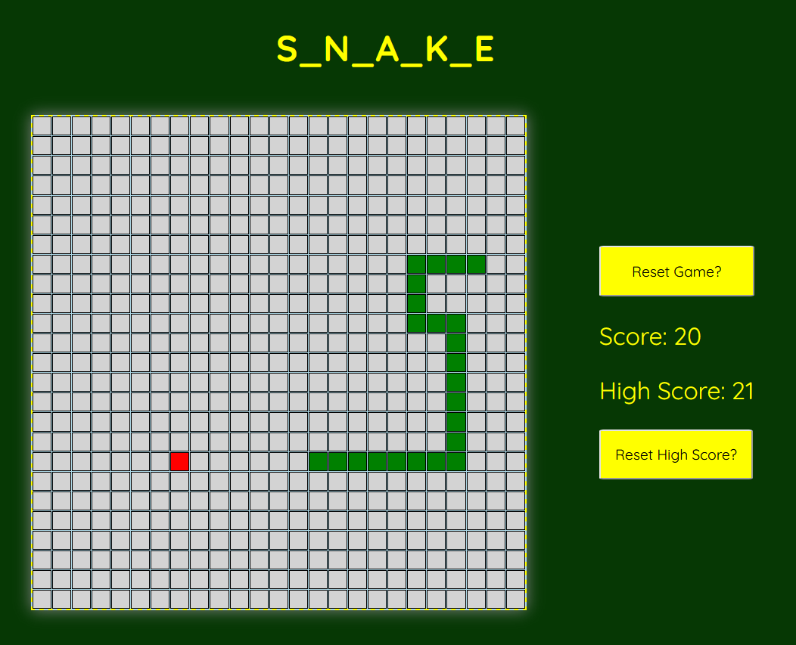

# Snake Game

## Getting Started
- The snake begins to move automatically on page load
- Use the arrow keys to control the snake's movement
- The objective is to 'eat' as much fruit as possible, while avoiding colliding with the grid walls or the snake itself 

## Technologies Used
JavaScript, HTML, CSS

## Planned improvements
- Option to change the colour of the snake and the fruit
- Add sounds effects for (1) eating fruit (2) winning (3) losing
- Add a game soundtrack with a toggle off button

## Link to planning material
<a href="https://trello.com/invite/b/66eed4effaaac31e36ca5e82/ATTIb0b9defa82c7796c68a534128acfbafc85A78862/ga-seb81-project-1">Trello Board</a>

# Playable link
(TBA) 